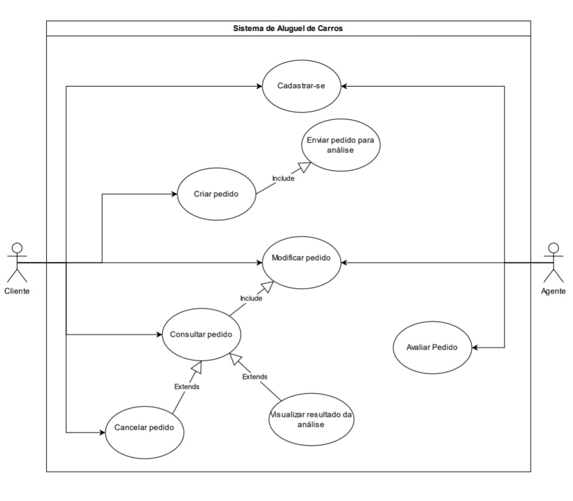
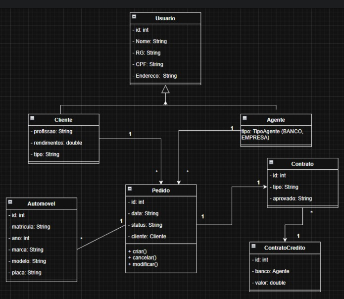

# 🏷️ Sistema de aluguel de carros

Sistema web desenvolvido para gerenciar o processo de aluguel de veículos, permitindo que clientes realizem solicitações de locação e que agentes realizem a análise e aprovação dos pedidos.

O projeto está sendo desenvolvido como parte da disciplina **Laboratório de Desenvolvimento de Software**.

---

## 🚧 Status do Projeto


[](https://github.com/Mateus7799/Lab-02-Sistema-de-Aluguel-de-Carros.git)

---

## 📚 Índice
- [Sobre o Projeto](#sobre-o-projeto)
- [Diagramas](#-diagramas)
- [Funcionalidades](#-funcionalidades-principais)
- [Autores](#-autores)
- [Tecnologias Utilizadas](#-tecnologias-utilizadas)


---
## 📝 Sobre o Projeto

Este projeto consiste no desenvolvimento de um sistema web para gerenciamento do processo de aluguel de veículos, permitindo a interação entre clientes e agentes responsáveis pela análise e aprovação das solicitações.

A aplicação tem como objetivo organizar e automatizar o fluxo de locação, desde o cadastro de usuários até a criação, acompanhamento e validação de pedidos de aluguel. Clientes podem realizar solicitações informando os dados necessários para a locação, enquanto agentes avaliam essas solicitações com base em critérios definidos, incluindo análise financeira e verificação de informações.

O sistema foi projetado com foco em organização, modularidade e clareza estrutural, utilizando conceitos de engenharia de software como modelagem UML, separação de responsabilidades e planejamento orientado a boas práticas de desenvolvimento.

Este projeto está sendo desenvolvido como parte da disciplina **Laboratório de Desenvolvimento de Software**, com o objetivo de aplicar na prática os conceitos estudados ao longo do curso.

**Principais características:**

- Cadastro e autenticação de usuários (clientes e agentes)
- Criação e gerenciamento de pedidos de aluguel
- Análise e aprovação de pedidos por agentes
- Organização modular baseada em boas práticas de engenharia de software

---

## 📷 Diagramas

### Diagrama de Casos de Uso



### Diagrama de Classes



### Diagrama de Pacotes


---

## ✨ Funcionalidades Principais

- Cadastro e login de usuários
- Criação de pedidos de aluguel
- Consulta e atualização de pedidos
- Cancelamento de pedidos
- Análise financeira de pedidos
- Aprovação ou reprovação de contratos
  
---

## 👨‍💻 Autores

- Arthur Modesto Couto
- Bernardo Carvalho Denucci Mercado
- Mateus Azevedo Araújo
- Matheus Dias Mendes
  

## 📁 Estrutura do Projeto

```
code/
├── pom.xml
└── src/main/
    ├── java/com/aluguel/
    │   ├── model/
    │   │   ├── Usuario.java       (PanacheEntity com id, nome, rg, cpf, endereco)
    │   │   └── Cliente.java       (extends Usuario com profissao + 3 rendimentos)
    │   └── controller/
    │       ├── ClienteController.java  (listar, criar, editar, deletar + validacoes)
    │       └── IndexController.java   (redireciona / para /clientes)
    └── resources/
        ├── application.properties  (H2 configurado, porta 8080)
        └── templates/
            ├── listar.html         (tabela com busca, editar e excluir)
            └── formulario.html     (formulario de cadastro/edicao com validacao de CPF/RG)

```


## 🚀 Como Executar

### Pré-requisitos

2. Acesse o codigo:
```bash
cd code
```

2. Execute o comando:
```bash
mvn quarkus:dev
```

3. Execute o comando:
```bash
http://localhost:8080
```

---

## 🛠️ Tecnologias Utilizadas

*Frontend:* Qute Templates (Server-side rendering para Páginas Dinâmicas).  
*Backend:* Java 17+, Quarkus (Framework), Hibernate Panache (ORM).
*Banco de Dados:* H2 Database (In-memory).

---
